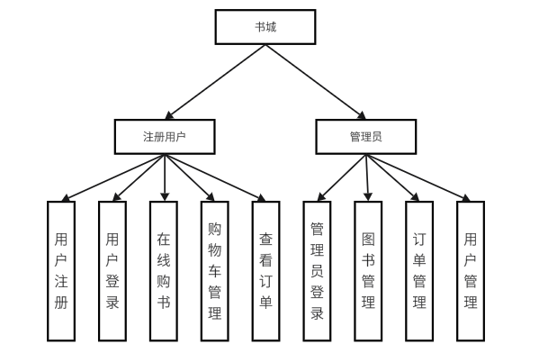
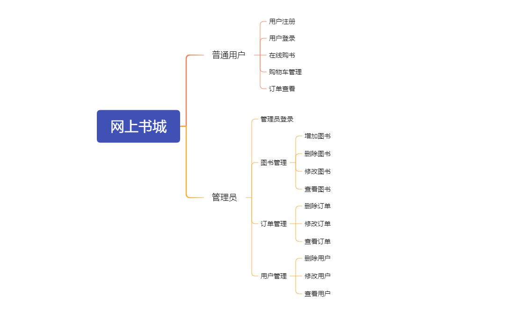
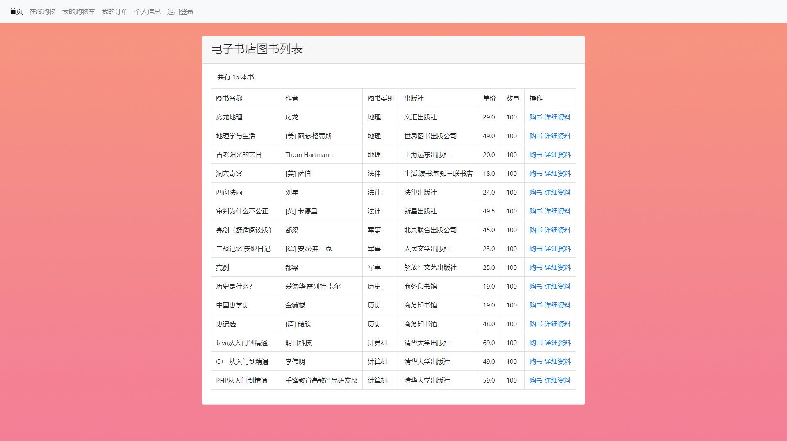
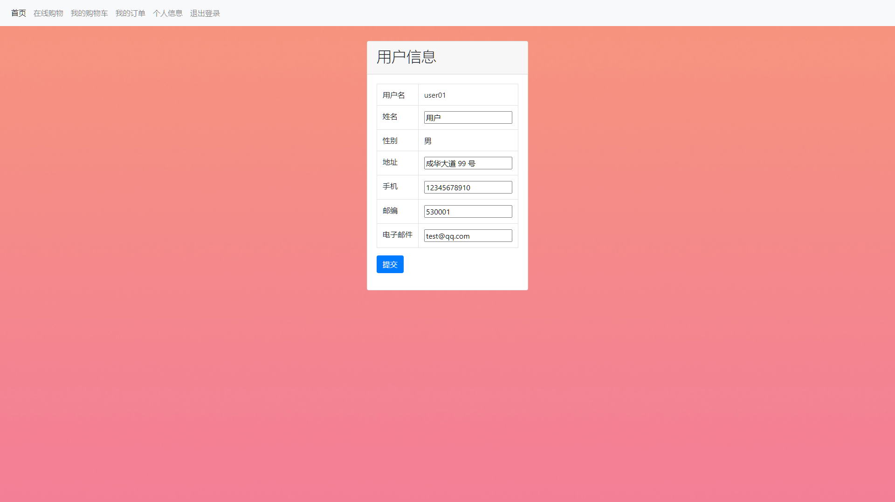
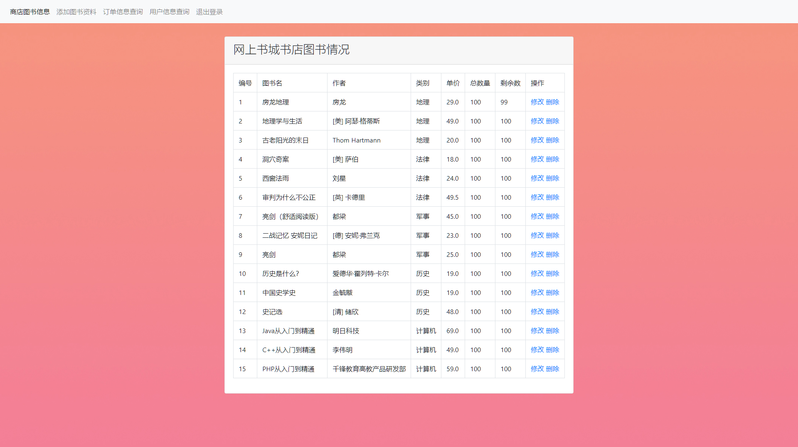
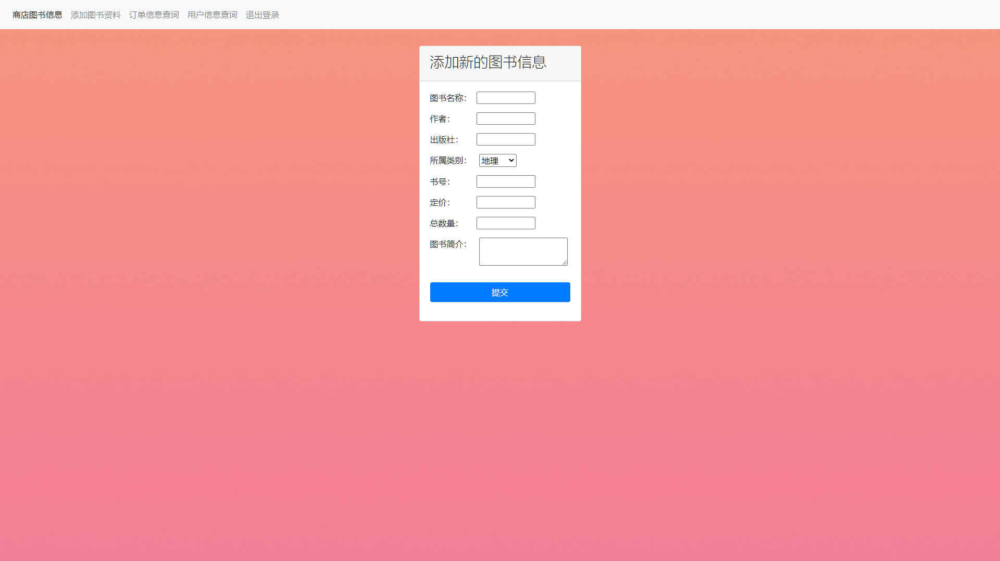
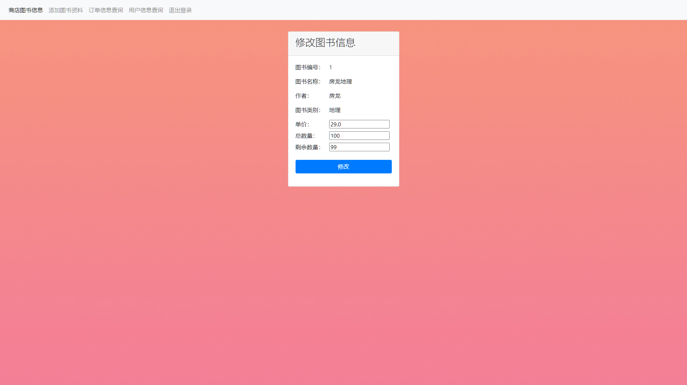
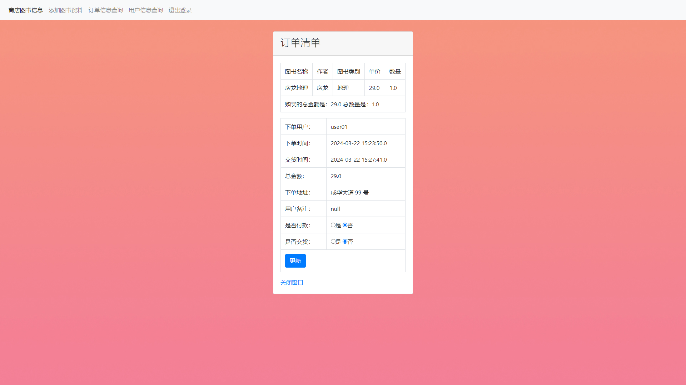
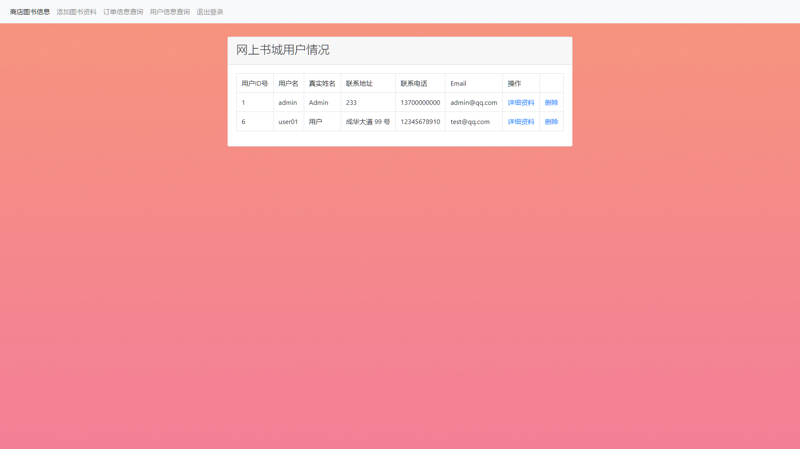
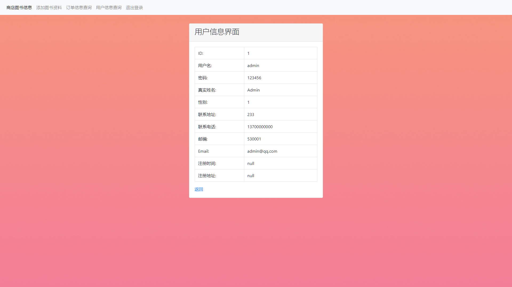

# 网上书城

项目名称：网上书城

技术栈：JSP + JavaBean + Servlet + JSTL 标签 + Bootstrap4 + MySQL

开发工具：IDEA 2023 / Navicat

开发环境：tomcat 9.0+ / MySql 5.7

管理员账号密码：Admin / 123456

用户账号密码：user01 / 123456

简介：一个简单的 JSP + Servlet 的购书网

本项目遵循 GPL-3.0 license 协议

## 项目结构图

## 模块功能

### 管理员

图书管理员可以进行

添加、删除、修改、查询图书信息

删除、修改、查询用户

查看、删除订单付款状态和发货状态

### 用户

修改个人基本信息

选购任意图书，购买数量，删除已选择的图书，取消购买，提交购买订单

购书后可以查看付款状态和发货状态

## 项目结构

### DAO - 业务层

| 名称           | 描述                                     |
| -------------- | ---------------------------------------- |
| BookInterface  | 用于图书的管理                           |
| BookDao        | 实现图书管理接口类，用于管理图书信息     |
| CartInterface  | 用于购物车的管理                         |
| CartDao        | 实现购物车管理接口类，用于管理购物车信息 |
| OrderInterface | 用于订单的管理                           |
| OrderDao       | 实现订单管理接口类，用于管理订单信息     |
| UserInterface  | 用于用户的管理                           |
| UserDao        | 实现用户管理接口类，用于管理用户信息     |

### Servlet - 控制器

| 名称             | 描述                     |
| ---------------- | ------------------------ |
| LoginServlet     | 用于进行用户登录操作     |
| RegisterServlet  | 用于进行用户注册操作     |
| DisplayServlet   | 用于渲染用户页面操作     |
| BookServlet      | 用于进行对图书操作       |
| OrderCartServlet | 用于进行对订单操作       |
| ShopCartServlet  | 用于进行对购物车操作     |
| UserInfoServlet  | 用于进行对于用户信息操作 |

### Filter - 过滤器

| 名称   | 描述             |
| ------ | ---------------- |
| Filter | 过滤未登录的用户 |

### Entity - 实体类

| 名称  | 描述         |
| ----- | ------------ |
| Book  | 图书实体类   |
| Cart  | 购物车实体类 |
| Order | 订单实体类   |
| User  | 用户实体类   |

### 普通页面

| 名称             | 描述         |
| ---------------- | ------------ |
| index.jsp        | 主页         |
| login.jsp        | 登录页       |
| register.jsp     | 注册页       |
| fail.jsp         | 登录失败页   |
| navbar.jsp       | 导航栏页     |
| admin-navbar.jsp | 管理员导航页 |

### 用户页面

| 名称          | 描述             |
| ------------- | ---------------- |
| book.jsp      | 图书详细页面     |
| booklist.jsp  | 书城图书页面     |
| buybook.jsp   | 购买图书页面     |
| cart.jsp      | 购物车页面       |
| update.jsp    | 更新图书页面     |
| order.jsp     | 订单页面         |
| orderlist.jsp | 订单信息详细页面 |
| user.jsp      | 用户页面         |
| userlist.jsp  | 用户信息详细页面 |

### 管理员页面

| 名称           | 描述         |
| -------------- | ------------ |
| booklist.jsp   | 图书列表页面 |
| updatebook.jsp | 更新图书页面 |
| addbook.jsp    | 添加图书页面 |
| orderlist.jsp  | 订单列表页面 |
| order.jsp      | 订单详细页   |
| userlist.jsp   | 用户列表页面 |
| user.jsp       | 用户详细页   |

## 数据库结构

### 图书信息表

| 列名       | 类型    | 长度 | 描述     |
| ---------- | ------- | ---- | -------- |
| id         | int     | 4    | id       |
| book_name  | varchar | 40   | 图书名称 |
| book_class | varchar | 255  | 图书类别 |
| author     | varchar | 25   | 作者     |
| publish    | varchar | 150  | 从出版社 |
| book_no    | varchar | 30   | 图书编号 |
| content    | varchar | 4000 | 图书简介 |
| price      | float   | 8    | 图书价格 |
| amount     | int     | 25   | 图书数量 |
| surplus    | int     | 25   | 剩余数量 |

### 购物车信息表

| 列名       | 类型    | 长度 | 描述     |
| ---------- | ------- | ---- | -------- |
| id         | int     | 11   | id       |
| user_id    | int     | 10   | 用户 id  |
| book_name  | varchar | 40   | 图书名称 |
| author     | varchar | 40   | 作者     |
| book_class | varchar | 40   | 图书类别 |
| price      | float   | 10   | 价格     |
| amount     | int     | 10   | 数量     |
| book_id    | int     | 10   | 图书 id  |

### 订单信息表

| 列名             | 类型     | 长度 | 描述     |
| ---------------- | -------- | ---- | -------- |
| id               | int      | 11   | id       |
| indent_no        | int      | 20   | 订单编号 |
| user_id          | varchar  | 20   | 用户 id  |
| user_name        | varchar  | 40   | 用户名称 |
| submit_time      | datetime | 0    | 提交时间 |
| consignment_time | datetime | 0    | 收货时间 |
| total_price      | float    | 8    | 总价     |
| content          | varchar  | 400  | 简介内容 |
| address          | varchar  | 255  | 收货地址 |
| is_pay_off       | varchar  | 20   | 付款状态 |
| is_sales         | varchar  | 20   | 收获状态 |
| book_name        | varchar  | 30   | 图书名称 |

### 用户信息表

| 列名      | 类型    | 长度 | 描述     |
| --------- | ------- | ---- | -------- |
| id        | int     | 11   | id       |
| user_name | varchar | 20   | 用户名   |
| pass_word | varchar | 50   | 用户密码 |
| names     | varchar | 20   | 名称     |
| sex       | varchar | 2    | 性别     |
| address   | varchar | 255  | 地址     |
| phone     | varchar | 25   | 手机号   |
| post      | varchar | 8    | 邮编     |
| email     | varchar | 50   | 电子邮件 |

## 项目预览

### 普通用户

#### 用户注册

#### 用户登录

#### 购书列表

#### 购书页面

#### 购物车

#### 订单查看

#### 信息修改

### 管理员用户

#### 图书列表

#### 增加图书

#### 修改图书

#### 订单列表

#### 修改订单

#### 用户列表

#### 查看用户

